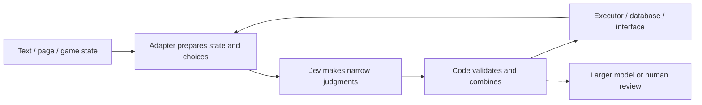

# How Jev apps work

[简体中文](2026-09-18-how-jev-apps-work.md) | **English**

Collected / sources reviewed: 2026-09-18. This explains official documentation and public examples at the application level. No reproduction experiments have been run here.

## Start with a sorting assistant

Imagine running a parcel depot. Someone must read each parcel's information and decide where it goes. Another part of the system moves the parcel. Jev fills a similar decision-making role inside software: give it a situation and clear questions, then let code use the answers.

This division explains why it can appear in very different applications. A mail organizer asks which label fits. A browser agent asks which action to take. A game asks which move to choose. The surrounding programs prepare different situations and carry out different actions, while the model supplies judgments.

A simple-looking choice can depend on useful information. If the program omits an obstacle's height, for example, the model may lack the evidence to decide whether a drone can fly over it. The quality of the input and the executor matters alongside the model itself. The [drone example](../cases/2026-09-18-drone-sim/README.en.md) illustrates this division.

## Three kinds of judgment

Jev receives a state and explicit questions, then returns typed results that software can use directly. [Official introduction](https://docs.typesafe.ai/introduction)

| Primitive | Plain meaning | Example uses |
| --- | --- | --- |
| Choice | Pick from listed options; return the choice, probability distribution and confidence | Select a model, tool, skill or game action |
| Score | Rate against defined levels and return the associated distribution | Code quality, content features or memory relevance |
| Noul | Estimate the probability that a specific statement is true | Whether support needs a human or a particular risk is present |

Questions in one request each assess the same state. They do not automatically pass their answers to one another. If a later question truly needs the previous answer to construct new input, code sends another request. [Official primitives documentation](https://docs.typesafe.ai/primitives)

Probability and `confidence` are different fields: Choice and Score confidence summarizes how concentrated the distribution is; Noul has no separate confidence field. An example output of 98% is not evidence of 98% accuracy across a task. Thresholds need validation on the intended use case. [Official confidence documentation](https://docs.typesafe.ai/confidence)

## The full application combines several parts

This diagram summarizes application patterns in the collection, not Jev's internal model architecture. A short video cannot establish undocumented training methods, state adapters or control policies.

| Combination | Examples | Transferable idea and boundary |
| --- | --- | --- |
| Fast judgment + deterministic executor | [Stagehand](../cases/2026-09-18-stagehand/README.en.md), [Rubik's Cube](../cases/2026-09-18-rubiks-cube/README.en.md) | Code constrains choices and implements rules; the executor and algorithms contribute substantial capability |
| Generative model + judgment model | [Papers](../cases/2026-09-18-papers/README.en.md), [Pac-Man](../cases/2026-09-18-pacman/README.en.md) | Separate summaries/planning from classification/local actions; measure full-pipeline cost |
| Screen, then escalate | [Email fraud](../cases/2026-09-18-email-fraud/README.en.md), [PR checks](../cases/2026-09-18-typed-pr-review/README.en.md) | Uncertain items take another route; final quality belongs to the combined system |
| Combine multiple dimensions | [Ad analysis](../cases/2026-09-18-ad-analysis/README.en.md), [JevMeter](../cases/2026-09-18-jevmeter/README.en.md) | Use specific questions and explicit aggregation; a score is not sufficient evidence of truth |
| Repeated choices create an output | [Word chat](../cases/2026-09-18-word-chat/README.en.md), [Character chat](../cases/2026-09-18-character-chat/README.en.md) | Code accumulates choices into text; this does not establish a native generation endpoint or cost advantage |

These designs align with official patterns such as routing, composite scoring and batched questions. Whether an individual project follows a specific pattern must be checked against its public implementation. [Official patterns](https://docs.typesafe.ai/patterns)

## Comparing fairly

1. **Use the same task:** fix inputs, candidates, environment and success criteria.
2. **Separate metrics:** per-decision latency, batch throughput and full-task time are distinct.
3. **Count all costs:** include perception, summaries, Jev, larger-model fallback, retries and execution.
4. **Measure errors:** accuracy, false positives/negatives, recovery and variation across runs are more informative than one successful clip.
5. **Record supporting information:** internal game state differs from screenshots; paused simulations differ from moving environments; coded solutions differ from model-derived strategies.

All 67 examples currently represent source research, not experiments run by this repository. Define reusable inputs and success criteria before recording reproduction results.

[All category comparisons](README.en.md) · [Homepage](../README.en.md)
