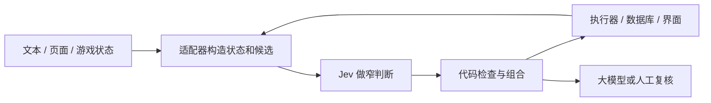

# Jev 应用如何工作

**简体中文** | [English](2026-09-18-how-jev-apps-work.en.md)

收录 / 更新 / 来源复查：2026-09-18。本文是官方文档与公开案例的应用层分析，未执行复现实验。

## 先想象一个分拣员

假设你在经营快递站：有人要读包裹信息，判断该送到哪里；另一套系统负责把包裹搬过去。Jev 在软件里承担的就是类似的判断工作——给它当前情况和清楚的问题，程序再根据答案采取行动。

所以它可以出现在看似不相干的应用里：邮件工具问“该贴什么标签”，浏览器助手问“下一步点哪里”，游戏问“该选哪个动作”。外面的程序负责准备不同的情况、执行不同的动作，模型负责其中的判断。

简单选择也需要有用的信息。例如程序没有提供障碍物的高度，模型就可能没有足够依据判断无人机能否飞过去。输入和执行器的质量，同样决定应用效果。[无人机案例](../cases/2026-09-18-drone-sim/README.md) 展示了这种分工。

## 三种基本判断

Jev 是 TypeSafe 的判断模型。输入是一份状态和明确的问题；输出是代码可以直接消费的类型化结果。[官方介绍](https://docs.typesafe.ai/introduction)

| 原语 | 输出含义 | 在应用中可以做什么 |
| --- | --- | --- |
| Choice | 从给定候选中选择，并返回概率分布、置信度 | 选模型、工具、技能、游戏动作 |
| Score | 按定义好的等级评分，并返回相关分布 | 代码质量、内容特征、记忆相关性 |
| Noul | 某个明确命题为真的概率值 | 是否需要人工、是否存在某类风险 |

同一请求里的问题分别对同一状态评估；问题之间不会自动把答案传递给彼此。需要依赖上一轮答案构造新状态时，程序再发下一轮请求。[官方原语说明](https://docs.typesafe.ai/primitives)

概率和 `confidence` 也不是同一字段：Choice / Score 的置信度概括分布的集中程度，Noul 没有单独的该字段。一个例子显示 98% 不能被记录成“整个任务准确率 98%”；门槛要用该业务的数据验证。[官方置信度说明](https://docs.typesafe.ai/confidence)

## 应用能力来自整个组合系统

这是对本批案例的共同结构归纳，不是 Jev 的内部模型架构图。原帖没公开的训练方法、输入适配和控制策略，不能靠短视频猜成事实。

| 组合方式 | 案例 | 可复用经验与边界 |
| --- | --- | --- |
| 快判断 + 确定性执行器 | [Stagehand](../cases/2026-09-18-stagehand/README.md)、[魔方](../cases/2026-09-18-rubiks-cube/README.md) | 候选和规则由代码约束；执行器与算法承担很大一部分能力 |
| 生成模型 + 判断模型 | [论文分类](../cases/2026-09-18-papers/README.md)、[吃豆人](../cases/2026-09-18-pacman/README.md) | 分别负责摘要/规划和分类/局部动作；统计整个流程费用 |
| 先筛选、再升级 | [邮件反欺诈](../cases/2026-09-18-email-fraud/README.md)、[PR 检查](../cases/2026-09-18-typed-pr-review/README.md) | 不确定结果走另外的路径；升级后质量属于组合系统 |
| 多个维度合并 | [广告分析](../cases/2026-09-18-ad-analysis/README.md)、[JevMeter](../cases/2026-09-18-jevmeter/README.md) | 问题要具体，汇总规则要明确；评分不是事实真伪的充分证据 |
| 多轮选择构成输出 | [词表聊天](../cases/2026-09-18-word-chat/README.md)、[字符聊天](../cases/2026-09-18-character-chat/README.md) | 程序把单步选择累积成文本；不能据此宣称模型原生生成接口或成本更优 |

这些设计与官方总结的分支路由、复合评分、批量提问等模式相符；具体项目是否完全遵循官方模式，要以它们的公开代码为准。[官方模式目录](https://docs.typesafe.ai/patterns)

## 如何公平比较

1. **固定任务**：同一输入、候选、环境、完成标准，再比较模型。
2. **分清指标**：单步模型延迟、批量吞吐、完整任务耗时分别记录。
3. **算完整费用**：感知、摘要、Jev、大模型回退、重试和执行器都计入。
4. **统计错误**：准确率、误报、漏报、失败恢复、多次运行波动都比一段成功视频更有说明力。
5. **标记辅助信息**：游戏内存状态与截图不同，暂停模拟器与持续运动不同，代码解法与模型自主推理也不同。

目前 67 个案例均只完成资料整理，没有本仓库的运行实验。后续实验应先写可复用输入和成功标准，再填实际结果。

[查看所有专题对比](README.md) · [返回首页](../README.md)
